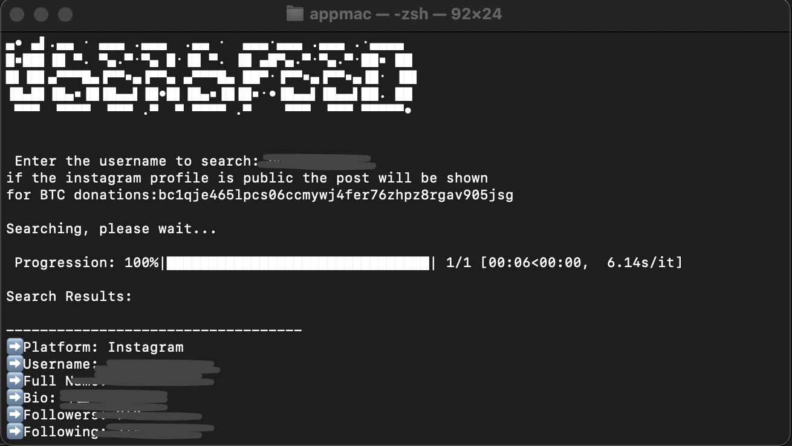

# UserSpeed

## Overview
UserSpeed is a tool that allows users to search for online profiles across multiple platforms using a given username. It retrieves information such as full name, bio, followers, and profile links from various social media and online platforms.


## Bitcoin Donations

If you find UserSpeed useful and would like to support its development, you can donate via Bitcoin:

**BTC Address**: `bc1qje465lpcs06ccmywj4fer76zhpz8rgav905jsg`

Your support is appreciated.

## Features
- Searches profiles on platforms like **Instagram, Twitter, GitHub, Steam, Roblox, Strava, Amazon, SoundCloud, Spotify, and Pinterest**.
- Displays **profile details** including full name, bio, followers, and external links.
- Provides a **confidence score** for profile matching.
- Uses `tqdm` for a **progress bar** and `rich` for **formatted output**.

## Installation
Ensure you have **Python installed**. Then, clone the repository and install dependencies.

```sh
# Clone the repository
git clone https://github.com/SiIv3r/userspeed.git
cd userspeed

# Create and activate a virtual environment
python3 -m venv env
source env/bin/activate  # On Windows, use env\Scripts\activate

# Install dependencies
pip install -r requirements.txt
```

## Usage

To run the tool, execute the following command:
```sh
python3 userspeed.py
```
You will be prompted to enter a username, and the tool will search across multiple platforms, displaying the results in a structured format.

## Dependencies

`requests` - for making HTTP requests
`beautifulsoup4` - for web scraping
`tqdm` - for progress indication
`rich` - for better terminal output
`pillow` - for image processing

## Contributions

Contributions are *welcome!* Feel free to fork the repository, *submit pull requests*, or *modify the script to suit your needs*.
